## 1. Edge Detection


*Reference: https://towardsdatascience.com/edge-detection-in-python-a3c263a13e03*

이미지의 `edge`란 **이미지의 밝기가 크게 변하는 특정 선분들의 집합**을 말한다. 즉, 이미지에서 밝기의 변화량이 가장 큰 지점을 의미한다.

Edge는 **사물 인식에서 가장 중요한 요소** 중에 하나인데, 사람이 물체를 인식할 때에 가장 주의깊게 보는 것이 바로 edge이기 때문이다. 본 문단의 가장 위에 있는 사진을 보자. 왼쪽 사진의 edge만을 따로 추출하여 흑백으로 표시한 것이 바로 오른쪽 사진이다. 그런데 우리는 오른쪽 사진만 보고도 이것이 원래 바람개비의 사진이었다는 것을 쉽게 유추할 수 있다. 색이나 텍스처 등의 부가 정보 하나 없이도 말이다.

`Edge detection`은 위와 같이 어떤 이미지에서 edge만을 검출하는 것을 말한다. 이번 글에서는 `Canny Edge Detector`에 대해서 다루어보려고 한다. [John Canny](https://en.wikipedia.org/wiki/John_Canny)가 1986년에 발표한 이 detector는 edge detection method 중에서 가장 간단한 편에 속하면서도 꽤나 훌륭한 성능을 내는 것으로 알려져 있다.

## 2. Background

### Sobel Operator

상술하였듯 Edge를 구하려면 이미지에서 밝기의 변화량을 구해야 한다. 

만약 이미지의 밝기가 1변수 연속함수라면 고등학교 때 배웠던 것처럼 도함수를 구하면 된다. 다변수 연속함수라면 편미분을 해서 `gradient`를 구하면 된다. 

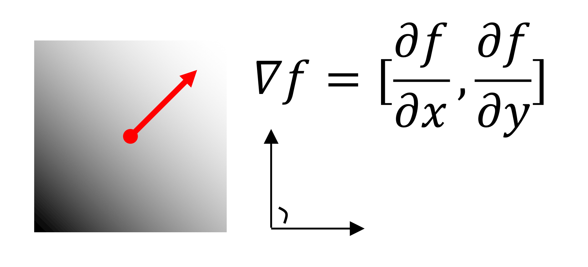
*&nbsp;*

하지만 이미지는 픽셀 단위로 나누어진 불연속함수이자 행렬이기 때문에 미분을 할 수 없다. 분야에 따라서 다양한 방법으로 불연속함수의 미분을 구하고 있는데, 컴퓨터 비전 분야에서는 **Stanford AI Lab**의 연구원 [Irwin Sobel](https://en.wikipedia.org/wiki/Irwin_Sobel)이 1968년에 제안한 `Sobel Operator`라는 $3 \times 3$ 행렬을 이용해서 gradient를 구하는 경우가 많다.

> $$
> \textnormal{G}_x = 
> \begin{bmatrix}
> -1 && 0 && 1 \\
> -2 && 0 && 2 \\
> -1 && 0 && 1 \end{bmatrix} \;
> \textnormal{G}_y = \begin{bmatrix}
> 1 && 2 && 1 \\
> 0 && 0 && 0 \\
> 1 && -2 && -1 \end{bmatrix}
> $$

위의 kernel을 원본 이미지에 convolution하면 각각 $x$-방향, $y$-방향의 이미지 변화량을 구할 수 있다. OpenCV 라이브러리에서는 `cv2.Sobel` 함수를 사용하면 된다.

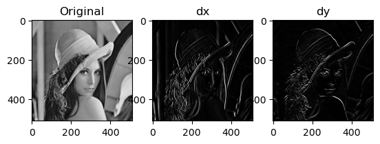
``` Python
import cv2
import matplotlib.pyplot as plt

img = cv2.imread('lenna.png', cv2.IMREAD_GRAYSCALE)
dx = cv2.Sobel(img, -1, 1, 0)
dy = cv2.Sobel(img, -1, 0, 1)
```

**dy** 를 보면 원본 이미지에는 있던 세로 방향의 기둥이 보이지 않는 것을 알 수 있다.

흥미로운 점은 Sobel operator만 적용해도 꽤나 그럴싸하게 edge detection이 되고 있다는 점이다. 하지만 Sobel operator에는 치명적인 문제점이 있다.

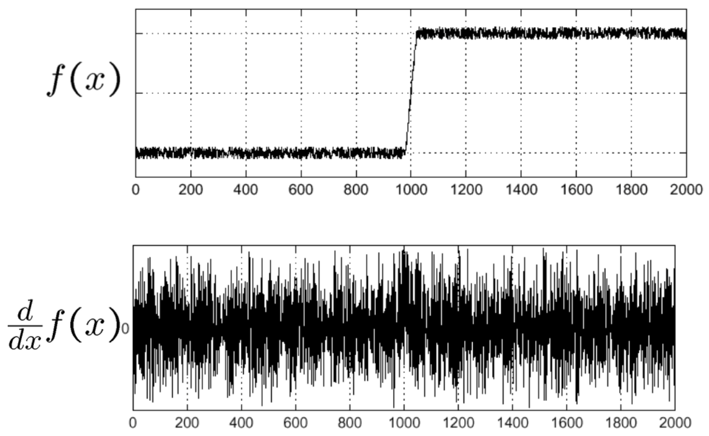
*Reference: [S. Seitz](https://www.smseitz.com)*

바로 noise에 취약하다는 것이다. $f(x)$를 봤을 때 사람인 우리는 $x=1000$ 주변에 edge가 있다는 것을 쉽게 알 수 있다. 하지만 이 함수를 미분한 두번째 그래프를 보면 noise 때문에 어디가 edge인지 도저히 알 수 없는 지경이 된다. 

따라서 Sobel operator를 적용하기 전에 이미지에 [Gaussian smoothing](/cv-gaussian-smoothing/)을 적용하여 denoising을 해주어야 한다. 

### Laplacian of Gaussian & Difference of Gaussian

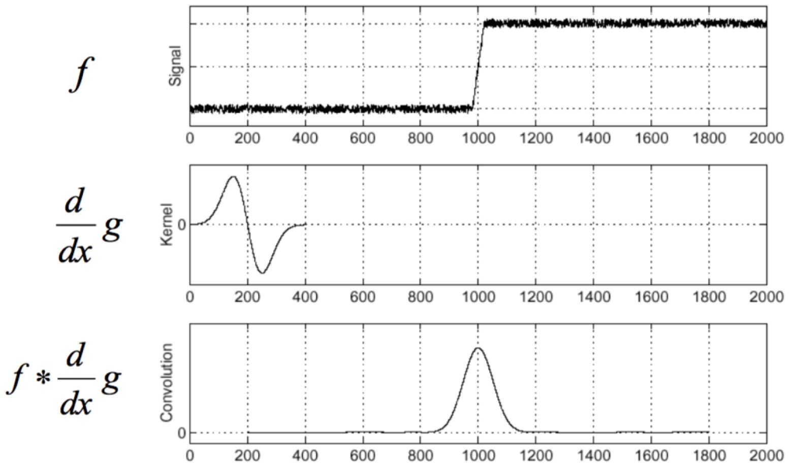
*Reference: [S. Seitz](https://www.smseitz.com)*

Gaussian kernel을 $g$라 하면, Gaussian smoothing을 적용한 이미지는 $g*f$이다.

이를 $x$에 대해 미분하면 $\dfrac{d}{dx}(g*f) = (\dfrac{d}{dx}g)*f$가 된다. 따라서 2번째 그래프에 표시된 커널($\dfrac{dg}{dx}$)을 $f$에 convolution해주면, 그것이 바로 **Gaussian smoothing된 이미지의 $x$-방향 변화량**이 된다.

우리는 이 함수의 최댓값을 구하고 싶다. 그렇다면 이 함수를 다시 한 번 더 미분해서 **극댓값**을 찾으면 된다. 즉, $\dfrac{d^2}{dx^2}g$를 구해서 $f$에 convolution했을 때의 $x$절편이 edge가 된다.

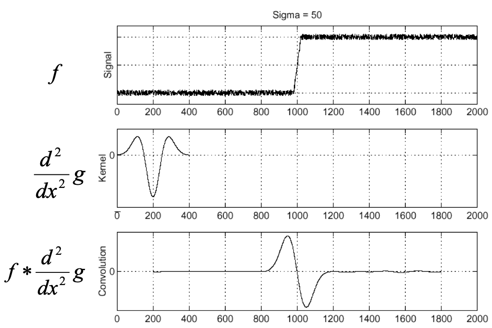
*Reference: [S. Seitz](https://www.smseitz.com)*

위 그림의 두번째 그래프가 바로 $\dfrac{d^2}{dx^2}g$를 도시한 것이다. 

지금까지는 $f$가 1변수 연속함수라고 가정하였다. 하지만 이미지는 2변수 함수이기에, 이미지에 $\nabla^2 g = (\dfrac{\partial^2}{\partial x^2} g, \dfrac{\partial^2}{\partial y^2} g)$ 를 convolution해줘야 한다. $\nabla^2 g$를 `Laplacian of Gaussian (LoG)`이라 한다.

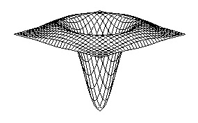
*Reference: https://homepages.inf.ed.ac.uk/rbf/HIPR2/log.html*

LoG는 이렇게 생겼다. 멕시코인들이 쓰는 모자인 [솜브레로](https://en.wikipedia.org/wiki/Sombrero)처럼 생겼다고 Mexican Hat Function이라고도 불린다.

그런데 LoG를 구하려면 Gaussian kernel에 미분을 2번, 다시 말해 Sobel operator를 이용한 convolution을 2번 적용해줘야 한다. 그리 효율적이지는 않은 방법이다.

다행히 수학적으로 **LoG는 두 Gaussian function의 차(Difference of Gaussian)와 비슷하다**는 사실이 알려져 있다. 자세한 증명은 [Wikipedia](https://en.wikipedia.org/wiki/Difference_of_Gaussians)를 참고하도록 하자. 어찌됐든 우리는 비효율적인 LoG 대신 `Difference of Gaussian (DoG)`을 구해서 계산해도 된다는 사실만 알면 된다.

## 3. Canny Edge Detector

이제 본격적으로 Canny edge detector의 알고리즘에 대해 Python 코드와 함께 알아보도록 하자.

### 1) Gaussian Smoothing

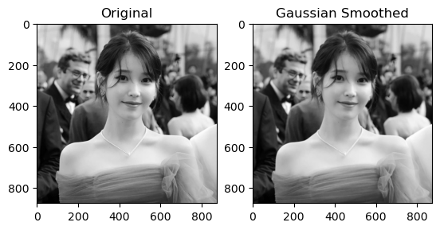
```Python
import numpy as np
import cv2
import matplotlib.pyplot as plt

img = cv2.imread('iu.jpg', cv2.IMREAD_GRAYSCALE)
blurred = cv2.GaussianBlur(img, (0, 0), 1)
```

`cv2.GaussianBlur`를 이용해 $\sigma=1$의 Gaussian smoothing을 진행한다. 원본 이미지의 noise 정도에 따라서 $\sigma$를 조정하면 된다.

### 2) Find Gradient Magnitude and Direction

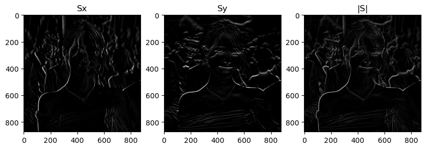
```Python
sx = cv2.Sobel(blurred, -1, 1, 0) # df/dx
sx = sx / sx.max() * 255 # Normalize
sy = cv2.Sobel(blurred, -1, 0, 1) # df/dy
sy = sy / sy.max() * 255 # Normalize
s = np.hypot(sx, sy) # |grad f|
s = s / s.max() * 255 # Normalize
theta = np.arctan2(np.abs(sy), np.abs(sx)) # Gradient direction (radian)
```

`cv2.Sobel`을 이용해 gradient image를 구한다. 

여기서 유의해야 할 점은, OpenCV의 Sobel operator는 normalize되지 않았기 때문에 `blurred`의 최댓값과 `sx`, `sy`의 최댓값이 다르다는 것이다. 따라서 이들을 같게 만들어주는 작업이 필요하다.

`s`와 `theta`는 (sx, sy)를 **극좌표계**로 변환하였을 때의 magnitude와 direction 값이다. `numpy`를 활용하여 구할 수 있다.

### 3) Non-maximum Suppression

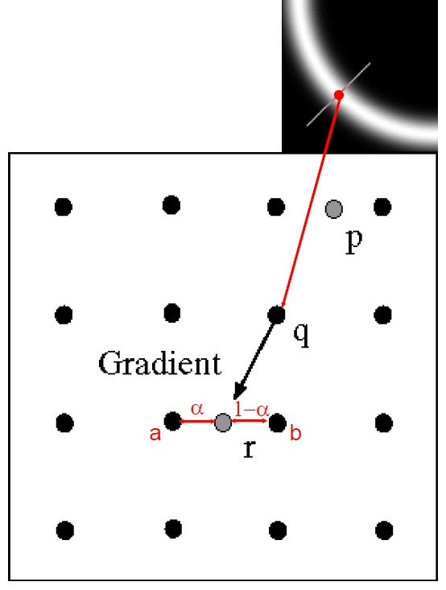
*Reference: https://justin-liang.com/tutorials/canny/*

`Non-maximum Suppression(NMS)`이란, 특정 구역에 속한 값들 중에서 최댓값을 제외한 나머지 값(non-maximum)들을 0으로 누르는(suppress) 것을 말한다.

2)에서 구한 값을 통해 우리는 이미지 상의 어떤 픽셀 `q`에서의 gradient를 찾을 수 있다. 이때 `q`로부터 gradient 방향으로 한 칸 떨어져 있는 픽셀 `r`과 그 반대 방향에 있는 `p`를 조사한다. 이때 `r` 또는 `p`의 값이 `q`보다 크다면 `q`의 값을 0으로 만든다.

이미지는 불연속함수이기 때문에, 위 그림처럼 `p`나 `r`이 정확히 어떤 픽셀을 가리키지 않고 어떤 두 픽셀 사이의 지점이 될 수도 있다. 

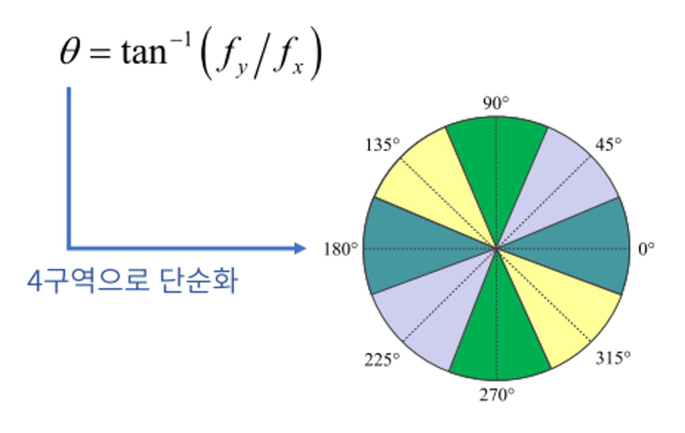
*Reference: https://gaussian37.github.io/vision-concept-edge_detection/*

따라서 위와 같은 방법으로 0~360$\degree$를 4개의 구역으로 나누어서 `p`와 `r`을 구하게 된다.


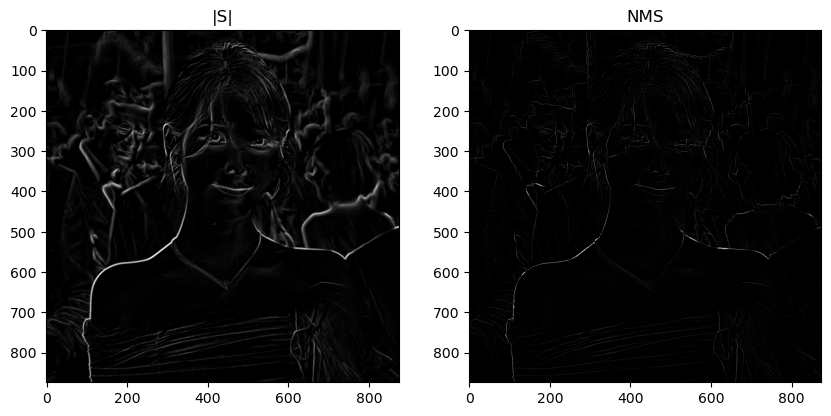
```Python
row, col = s.shape
nms = np.zeros((row, col))
angle = np.rad2deg(theta) # Rad -> Degree
angle[angle < 0] += 180 

for i in range(1, row - 1):
    for j in range(1, col - 1):
        p, r = 255, 255

        if (0 <= angle[i, j] < 22.5) or (157.5 <= angle[i, j] <= 180):
            p = s[i, j+1]
            r = s[i, j-1]
            
        elif 22.5 <= angle[i, j] < 67.5:
            p = s[i+1, j-1]
            r = s[i-1, j+1]

        elif 67.5 <= angle[i,j] < 112.5:
            p = s[i+1, j]
            r = s[i-1, j]

        elif 112.5 <= angle[i,j] < 157.5:
            p = s[i-1, j-1]
            r = s[i+1, j+1]
        
        # NMS
        if (s[i,j] >= p) and (s[i,j] >= r):
            nms[i,j] = s[i,j]
        else:
            nms[i,j] = 0
```

### 4) Thresholding (Hysteresis Edge Tracking)

이제 3)에서 얻어진 NMS 이미지를 바탕으로 thresholding을 통해 edge인지 아닌지를 구분해주면 된다.

간단하게는 **'어떤 픽셀의 밝기가 특정 값보다 크면 edge이다'** 라고 설정할 수도 있다. 이를 `single thresholding` 또는 `standard thresholding`이라고 한다.

하지만 이러한 방식은 **'진한' edge만 걸러낼 수 있다**는 단점이 있다. 때문에 NMS 이미지에 single thresholding을 적용하게 되면 edge가 뚝뚝 끊어져서 나오게 된다.

이러한 단점을 보완하기 위해 Canny edge detector에서는 보통 `hysteresis edge tracking`이라는 방법을 사용한다.

총 2개의 threshold를 사용하는데, 그 중 값이 큰 것을 `high`, 작은 것을 `low`라고 하자. 

* 만약 어떤 픽셀의 값이 **`high`보다 크다**면 edge이다.
* **`high`보다는 작지만 `low`보다는 크다**면 주변 픽셀들을 확인한다.
  * 만약 주변에 edge인 픽셀이 있다면 edge이다.
  * 없다면 edge가 아니다.
* **`low`보다 작다**면 edge가 아니다.

이렇게 `Hysteresis thresholding`을 사용하면 끊김이 적고 쭉 이어진 형태의 edge를 얻을 수 있게 된다.

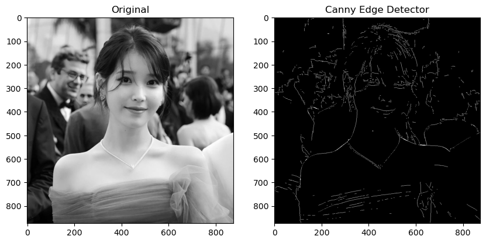
```Python
canny = np.zeros((row, col))

# Thresholds
high = 40
low = 10

# Hysteresis Thresholding
for i in range(1, row - 1):
    for j in range(1, col - 1):
        try:
            if nms[i, j] > high:
                canny[i, j] = 255
            elif low < nms[i, j] <= high:
                if (nms[i-1, j-1] > high) or (nms[i-1, j] > high) or (nms[i-1, j+1] > high) or (nms[i, j-1] > high) or (nms[i, j] > high) or (nms[i, j+1] > high) or (nms[i+1, j-1] > high) or (nms[i+1, j] > high) or (nms[i+1, j+1] > high):
                    canny[i, j] = 255
                else:
                    canny[i, j] = 0
            else:
                canny[i, j] = 0
        except IndexError as e:
            pass
```

### OpenCV - Canny

OpenCV에는 이러한 과정을 한번에 해결해주는 `cv2.Canny` 함수가 있다.

```Python
cv.Canny(image, threshold1, threshold2)
```
> `image` 원본 이미지
> 
> `threshold1` 위 코드에서 `low`에 해당하는 threshold
> 
> `threshold2` 위 코드에서 `high`에 해당하는 threshold

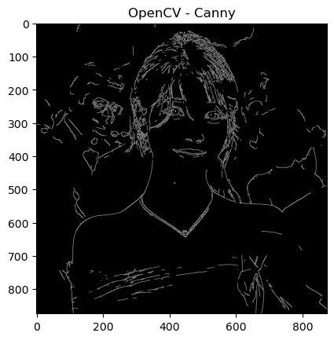
```Python
cv_canny = cv2.Canny(img, 100, 150)
```

전체 코드가 포함된 Jupyter Notebook 파일은 아래 repository에서 확인할 수 있다.

[](https://github.com/partlyjadedyouth/Computer-Vision-Example-Codes/blob/main/canny_edge.ipynb)

## 4. Limitation

Canny edge detector는 여러 edge detection method 중에서 간단하고 이해하기 쉽다는 장점이 있다.

그러나, Gaussian smoothing에서의 `σ`나 `threshold` 등 몇몇 parameter들에 따라 그 결과가 크게 바뀌기 때문에 적절한 값을 찾기 위해 몇 차례의 시행착오를 거쳐야 한다는 단점이 있다.

```toc

```