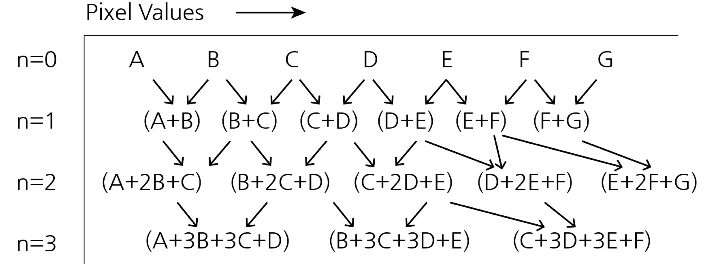
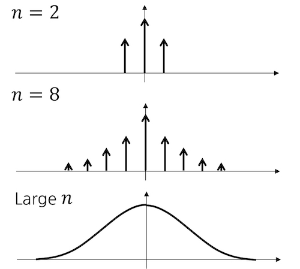
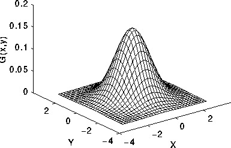
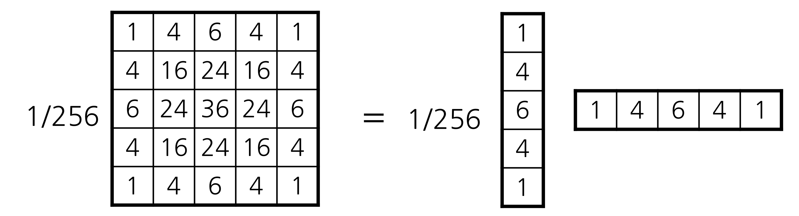
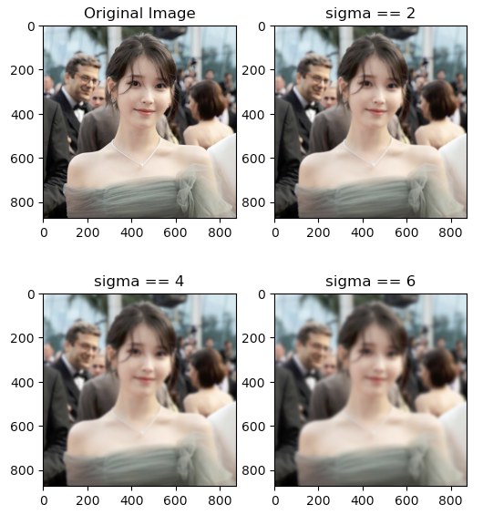

Smoothing이란 쉽게 말해 **이미지를 흐릿하게 만들어주는 것**이다. 

Smoothing은 보통 이미지의 노이즈를 제거할 때 사용된다. 원리는 어떻게 보면 아주 간단하다. 이미지를 뭉개면서 노이즈까지 같이 뭉개 버리는 것이다.

`가우시안 스무딩(Gaussian smoothing)`, 또는 `가우시안 블러(Gaussian blur)`는 컴퓨터 비전 분야에서 가장 보편적으로 사용되는 smoothing 기법이다. 

이 글에서는 Gaussian smoothing에 사용되는 Gaussian kernel이 무엇이고 어떻게 이 kernel을 통해 smoothing을 하게 되는지, 그리고 OpenCV 라이브러리를 이용해 Python으로 Gaussian smoothing을 직접 구현하는 방법까지 다루어보려고 한다.

## 1. Averaging & Gaussian Distribution


*직관적인 예시를 들기 위해 이미지의 가로 길이가 1px이라고 가정하였고 나눗셈도 생략하였다.*

이미지를 흐릿하게 만드는 가장 간단한 방법은 위의 그림처럼 인접한 두 픽셀 값의 평균을 내는 것이다.

$n=2$일 때는 원래 이미지에 커널 [1, 2, 1]을 convolution해준 것과 같고, $n=4$일 때는 (A + 4B  + 6C + 4D + E)와 (B + 4C + 6D + 4E + F)가 나올 것이니 [1, 4, 6, 4, 1]을 convolution해준 것과 같다고 결과를 해석할 수도 있다. 


*&nbsp;*

이렇게 $n$을 계속 키워가면서 커널을 구한 다음 그 값을 좌표평면 위에 나타내게 되면 `정규분포(Gaussian distribution)` 곡선과 유사한 형태를 띈다는 것을 알 수 있다.

즉, **이미지에서 인접한 픽셀의 평균을 반복해서 구하는 것은 결국 Gaussian function과 이미지의 convolution으로 근사할 수 있다**는 것이다.

## 2. Gaussian Kernel

위의 예시에서는 이미지의 가로가 1px이라고 가정하였다. 그러나 가로 또는 세로가 1px인 경우는 거의 없으므로, 실제로는 $N \times N$ 행렬 형태의 2D Gaussian function을 사용한다. 이를 `가우시안 커널(Gaussian kernel)` 또는 `가우시안 필터(Gaussian filter)`라고 부른다.


*Reference: [D. Sathyamoorthy](https://www.researchgate.net/publication/26487220_Linear_and_nonlinear_approach_for_DEM_smoothening)*

> $$
> h(i, j) = \cfrac{1}{2 \pi \sigma^2} \textnormal{exp}(-\cfrac{i^2 + j^2}{2 \sigma^2})
> $$

Gaussian function을 흔히 '종 모양'으로 생겼다고 말한다. 중심부에 가까울 수록 위로 볼록 튀어나와 있는 모양이다. 이를 이미지에 convolution하면 **Gaussian kernel의 중심에 가까울 수록 더 높은 가중치(weight)를 가지게 된다.**

Gaussian kernel에서 결정해야 할 유일한 parameter는 바로 $\sigma$이다. 

1. $\sigma$가 커질 수록 분포가 더 넓게 흩어진 모양이 된다. 다시 말해, 이미지의 가장자리 부근의 weight가 더 커지게 된다. **따라서 $\sigma$가 커질 수록 이미지가 더 흐려진다.**
2. $\sigma$는 Gaussian kernel의 크기도 결정한다. 직접 계산해보면 알 수 있겠지만 $i$와 $j$가 $\sigma$의 3배보다 커지게 되면 그 값이 0.01 이하로 떨어지는데, 이처럼 충분히 작은 값들은 weight로서의 가치가 없으므로 굳이 고려해줄 필요가 없다.

Kernel을 이용한 이미지 프로세싱에서 kernel size는 상당히 중요한 요소인데, $N \times N$ kernel과 $P \times Q$ 이미지를 convolution하면 그 시간 복잡도(time complexity)는 $O(PQN^2)$가 되기 때문이다. 무턱대고 크기를 키워버리면 계산 시간을 꽤나 잡아먹게 된다는 것이다.

이제 이 커널을 이미지에 convolution해보자. 아래와 같이 계산할 수 있다.

> $$
> g(i, j) = \cfrac{1}{2 \pi \sigma^2} \sum_{m} \sum_{n} \textnormal{exp}(-\cfrac{m^2+n^2}{2\sigma^2})f(i-m, j-n)
> $$

위의 식을 조금만 바꾸어 보자.

> $$
> g(i, j) = \cfrac{1}{2 \pi \sigma^2} \sum_{m} \textnormal{exp}(-\cfrac{m^2}{2\sigma^2}) \sum_{n} \textnormal{exp}(-\cfrac{n^2}{2\sigma^2}) f(i-m, j-n)
> $$

단순히 지수함수 안에 합쳐져 있던 $i$와 $j$를 분리한 것이다.

여기에서 우리는 $N \times N$ Gaussian kernel을 바로 convolution한 것과, kernel을 $x$-성분과 $y$-성분으로 분리한 다음 차례로 convolution해주는 것이 같다는 것을 알아냈다. 이는 Gaussian kernel이 상하좌우로 대칭(circularly symmetric)인 행렬이기 때문에 가능한 것이다.


*좌변의 행렬은 $\sigma=1$일 때의 Gaussian kernel을 적절히 근사한 값이다.*

이렇게 만들면 시간 복잡도가 $O(PQN^2)$에서 $O(2PQN)$으로 크게 줄어든다. 그래서 **kernel을 그대로 사용하기보단 $x$-성분과 $y$-성분으로 나누어서 계산하는 것이 더 효율적이다.**

## 3. Python Implementation

OpenCV의 `GaussianBlur`를 이용하면 Gaussian smoothing을 쉽게 구현할 수 있다.

```python
cv2.GaussianBlur(src, ksize, sigmaX, dst=None, sigmaY=None, borderType=None)
```
> src: 원본 이미지
> 
> ksize: Gaussian kernel size. (0, 0)을 넣을 경우 sigmaX를 이용해 알아서 계산해준다.
>
> sigmaX: $x$-성분 $\sigma$
>
> sigmaY: $y$-성분 $\sigma$. 아무것도 넣지 않을 경우 sigmaX와 같게 설정된다.
>
> borderType: 이미지의 가장자리에서 확장된 픽셀 값을 채우는 방법. [참고](https://docs.opencv.org/3.4/d2/de8/group__core__array.html#ga209f2f4869e304c82d07739337eae7c5)

### Example Code
```python
import cv2
import matplotlib.pyplot as plt

src = cv2.cvtColor(cv2.imread("img.jpg"), cv2.COLOR_BGR2RGB)

sigma = [2, 4, 6]

plt.figure(figsize=(6, 7))    
plt.subplot(2, 2, 1)
plt.imshow(src)
plt.title("Original Image")

for i in range(len(sigma)):
    plt.subplot(2, 2, i + 2)
    plt.imshow(cv2.GaussianBlur(src, (0, 0), sigma[i]))
    plt.title(f"sigma == {sigma[i]}")
    
plt.show() 
```

### Result


```toc

```