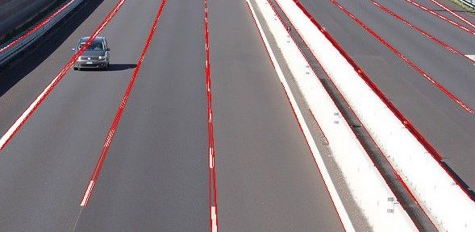
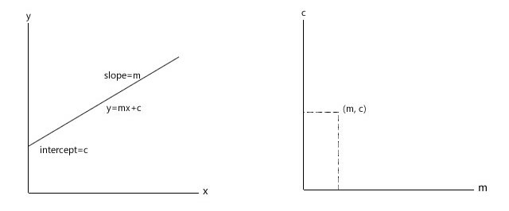
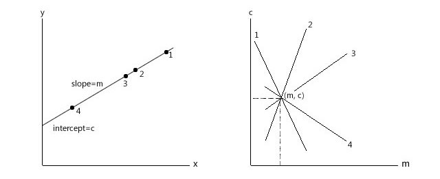
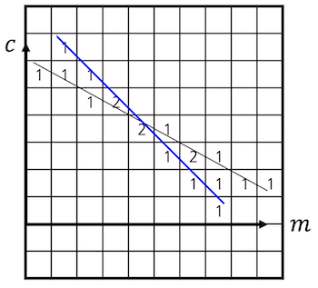
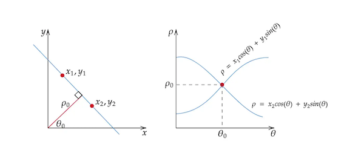
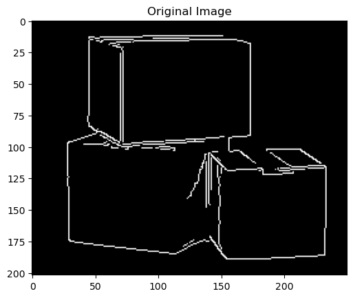
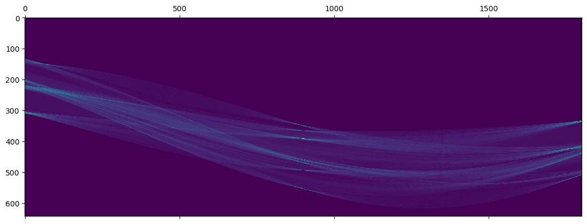
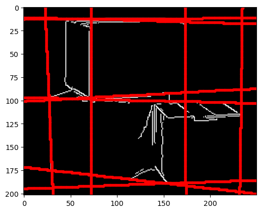

*Reference: https://learnopencv.com/hough-transform-with-opencv-c-python/*

[이전 글](/cv-edge-detection)에서는 이미지에서 edge란 무엇인지, 그리고 이미지에서 edge를 찾아내는 방법 중 하나인 `Canny edge detector`에 대해 살펴보았다.

`Hough Transform`은 이미지 상에서 특정 형태(직선, 원, 타원 등)를 가진 edge의 방정식을 찾아내는 알고리즘이다. 1962년에 **Paul V. C. Hough**가 등록한 [특허](https://patents.google.com/patent/US3069654)로부터 시작된 Hough transform은 이후 수많은 학자들의 후속 연구 덕분에 가장 고전적인 형태 인식 알고리즘으로 자리잡게 되었다.

이 글에서는 Hough transform의 기본 원리와 활용, 그리고 Python을 이용해 Hough transform을 구현하는 방법에 대해 알아보려고 한다.

## 1. Basic Idea


*Reference: https://aishack.in/tutorials/hough-transform-basics/*

기울기가 $m$이고 $y$절편이 $c$인 직선 $y=mx+c$가 어떤 점 $(x_1, y_1)$을 지난다. 

이 경우 $y_1 = m x_1 + c$라는 관계식이 성립하는데, 이는 $mc$평면 위의 한 직선인 $c = -mx_1 + y_1$로 쓸 수도 있다.

즉, $(x_1, y_1)$이라는 점을 $mc$평면 위의 점 $(m, c)$를 지나는 직선 $c = -mx_1 + y_1$을 통해 표현할 수도 있다는 것이다.


*Reference: https://aishack.in/tutorials/hough-transform-basics/*

직선 $y=mx+c$ 위의 모든 점들을 $mc$평면 위의 직선으로 나타내보자. 이들은 전부 $mc$평면 위의 점 $(m, c)$에서 만날 것이다.

이제 거꾸로 생각해보자. 이미지 상의 어떤 점들을 모두 지나는 직선의 방정식을 찾으려면 어떻게 해야 할까? 

**바로 이 점들을 $mc$평면 위의 직선으로 그려준 다음 이들의 교점을 찾으면 된다.**

물론 이미지는 연속함수가 아니라 픽셀 단위로 나누어진 불연속함수이기 때문에, 교점의 좌표가 정확히 하나로 딱 떨어질 가능성은 높지 않다. 



그래서 Hough transform은 `voting`이라는 방식을 사용한다.

$mc$평면을 일정 간격으로 분할(quantize)하여 `accumulator array`를 만든 다음, 직선이 어떤 칸을 지날 때마다 그 칸의 숫자를 1씩 늘려준다. 이 작업을 모든 직선에 대해서 진행한 후 가장 크기가 큰 칸(가장 많은 표를 얻은 후보, **local maximum**)을 찾아서 그 좌표를 교점으로 본다.

이렇게 **edge 상의 모든 점을 $mc$평면 위에 나타낸 다음, 값이 가장 큰 $(m, c)$ 값을 찾아낸다**는 것이 바로 1962년에 Hough가 발표한 특허의 내용이다.

## 2. Hough Space

그런데 이렇게 $mc$평면을 이용하여 직선을 표현하게 되면 치명적인 문제가 생긴다.

2차원 평면 상의 직선이 가질 수 있는 기울기의 범위는 $-\infty \leq m \leq \infty$ 이다. Accumulator array의 크기가 무한히 커지게 된다는 것이다. 즉, 컴퓨터 상에서 accumulator array를 저장해야 할 메모리의 크기가 무한히 커야 한다는 것인데 이는 현실적으로 불가능하다.


*Reference: https://towardsdatascience.com/lines-detection-with-hough-transform-84020b3b1549*

이러한 문제점을 해결하기 위해 **Richard O. Duda**와 **Peter E. Hart**는 1972년에 발표한 논문에서 직선의 기울기 대신 **원점에서 직선까지의 거리 $\rho$와 그 편각인 $\theta$를 이용하여 직선을 표현**할 것을 제안하였다. 이렇게 할 경우 $\rho$의 최댓값은 **이미지의 대각선의 길이**, $\theta$의 범위는 $-\pi/2$ ~ $\pi/2$가 된다.

> $$
> m = -\cfrac{\cos \theta}{\sin \theta}, \; c = \cfrac{\rho}{\sin \theta}
> $$

$m$과 $c$ 대신 위의 값들을 넣게 되면 직선의 방정식은 $\rho = x \cos \theta + y \sin \theta$ 가 된다.

이를 가로축이 $\theta$, 세로축이 $\rho$인 평면에 그리게 되면 삼각함수가 그려지게 된다. 이 평면과 삼각함수를 각각 `Hough space`와 `Hough space sinusoid`라고 부른다.

그 뒤의 과정은 전부 동일하다. Hough space sinusoid가 지나는 칸마다 숫자를 +1 해주고, 그 중에서 가장 큰 값을 찾아주면 된다.

## 3. Python Implementation

OpenCV 라이브러리의 `HoughLines` 함수를 사용하면 Hough transform을 구할 수 있지만, 학습을 위해 해당 함수를 사용하지 않고 Hough transform을 구현해보았다.

아래의 코드는 [이곳](https://jstar0525.tistory.com/66)을 참고하여 작성하였음을 밝혀둔다.

### 1) Detect Edges


```Python
import cv2
import numpy as np
import matplotlib.pyplot as plt

box = cv2.imread("box.jpg", cv2.IMREAD_GRAYSCALE)
box_canny = cv2.Canny(box, 100, 200)   # Edge detection by Canny
box_bin = np.array(box_canny)
box_bin[box_bin > 0] = 1 

plt.figure()
plt.imshow(box_bin, cmap="gray")
plt.title("Original Image")
plt.show()
```

Hough transform을 하려면 일단 edge detection이 선행되어야 한다.

`Canny edge detector`를 이용해 edge를 찾아주었다. 그리고 직관성을 위해 edge는 1, edge가 아니면 0으로 픽셀의 값을 전부 바꾸었다. 이렇게 만들어진 이미지를 `binary image`라고 한다.

### 2) Get Hough Space


```Python
theta_res = 0.1 # thetas: [-90, -90+theta_res, ... , 90-theta_res, 90]
rho_res = 1 # rhos: [-diag, -diag+rho_res, ... , diag-rho_res, diag]
img_row, img_col = box_bin.shape

# Theta for Hough space
theta_num = int(180 / theta_res + 1)
thetas = np.linspace(-90, 90, theta_num)
thetas[thetas==0.] = theta_res / 10 # Deal with Divide-by-0 problem
thetas_rad = np.deg2rad(thetas)

# Rho for Hough space
diag = int(np.sqrt(img_row**2 + img_col**2))
rho_num = int(2 * diag / rho_res + 1)
rhos = np.linspace(-diag, diag, rho_num)

hough_space = np.zeros((rho_num, theta_num))
for r in range(img_row):
    for c in range(img_col):
        if box_bin[r, c]: # Search for pixels in edges
            for theta_idx, rad in enumerate(thetas_rad):
                hough_sinusoid = c * np.cos(rad) + r * np.sin(rad)
                rho_idx = np.argmin(abs(rhos - hough_sinusoid)) # Find the closest rho
                hough_space[rho_idx, theta_idx] += 1

plt.matshow(hough_space)
plt.show()
```

Hough space를 구하고, Hough space sinusoid를 plot하였다. 색이 붉은색에 가까울 수록 많이 검출된 것이다.

$\theta$축에서 -90$\degree$, 90$\degree$와 0$\degree$ 근처에 vote가 몰려있는 것을 확인할 수 있는데, 원본 이미지를 보면 적절한 결과임을 알 수 있다.

### 3) Get Hough Lines

```Python
num = 10    # Number of Hough lines
threshold = 50  # To avoid duplicated Hough lines
hough_line_idx = [] # Array to save rho & theta of Hough lines

hough_tmp = hough_space.copy()
while len(hough_line_idx) < num:
    rho_idx, theta_idx = np.unravel_index(hough_tmp.argmax(), hough_tmp.shape)
    if len(hough_line_idx) == 0:
        hough_line_idx.append([rho_idx, theta_idx])
    else:
        tmp_idx = np.array(hough_line_idx)
        thr = abs(rhos[tmp_idx[:, 0]] - rhos[rho_idx]) + abs(thetas[tmp_idx[:, 1]] - thetas[theta_idx])
        if np.min(thr) > threshold:
            hough_line_idx.append([rho_idx, theta_idx])
        else:
            hough_tmp[rho_idx, theta_idx] = 0

hough_line_idx = np.array(hough_line_idx)
```

`num`개 만큼의 Hough line을 구하는 부분이다.

너무 가까이에 있는 Hough line들만 검출되는 것을 막기 위해 threshold를 도입하였다. 단순히 `rho`와 `theta`의 합이 50을 넘지 않으면 검출하지 않는 naive한 방법을 사용하였다. 보다 정확한 결과를 위해서는 개선해야 할 부분이다.

### 4) Draw Hough Lines


```Python
hough_line_rhos = rhos[hough_line_idx[:, 0]]
hough_line_thetas = thetas_rad[hough_line_idx[:, 1]]

m = -np.cos(hough_line_thetas) / np.sin(hough_line_thetas)
c = hough_line_rhos / np.sin(hough_line_thetas)

plt.figure()
plt.imshow(box_bin, cmap="gray")
for i in range(len(m)):
    for col in range(img_col):
        y = int(m[i] * col + c[i])
        if 0 <= y < img_row:
            plt.plot(col, y, marker='.', color="red")
    for row in range(img_row):
        x = int((row - c[i]) / m[i])
        if 0 <= x < img_col:
            plt.plot(x, row, marker = '.', color="red")
plt.show()
```

전체 코드가 포함된 Jupyter Notebook 파일은 아래 repository에서 확인할 수 있다.

[](https://github.com/partlyjadedyouth/Computer-Vision-Example-Codes/blob/main/hough.ipynb)

## 4. Pros and Cons of Hough Transform

Hough transform은 occlusion에 강하다는 장점이 있다. 물체가 중간에 끊어져 있어도 직선을 검출해낼 수 있다는 것인데, 글의 맨 위에 있는 차선 인식과 같은 분야에서 Hough transform이 자주 쓰이는 이유이기도 하다.

또한, 이번 글에서는 직선을 검출하는 방법에 대해서만 다루었지만 알고리즘을 약간만 수정한다면 원과 타원을 비롯한 임의의 형태를 전부 다 검출할 수 있다. 이를 `Generalized Hough transform (GHT)`이라 하는데, 초창기의 사물 인식 분야에서는 GHT를 많이 사용하였다. GHT에 대해서는 다음 글에서 살펴보려고 한다.

단점도 있다. 먼저 noise에 취약하다. 다양한 사진으로 Hough transform을 해보면 알 수 있는데, 만약 noise pixel들이 일직선 상에 놓여있게 된다면 Hough transform은 이 또한 직선으로 인식하고 검출해버리게 된다. 또한 threshold들을 직접 튜닝하는 과정이 필요하다.

마지막으로, edge 상의 모든 pixel을 탐색하는 알고리즘이기 때문에 exponential time complexity를 가진다. 이 때문에 이미지의 해상도가 크면 계산 시간이 상당히 오래 걸린다.

```toc

```