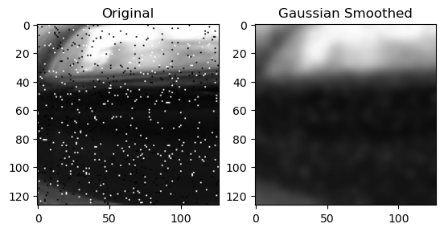
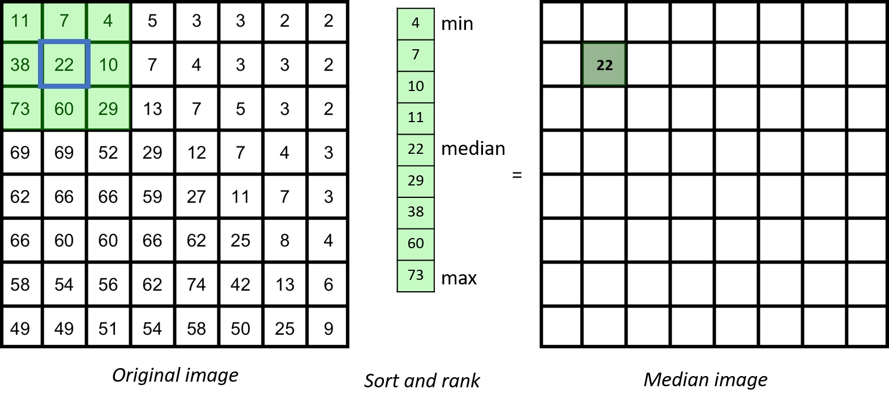
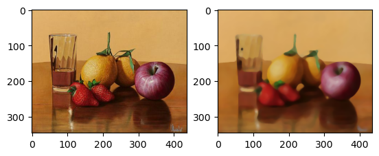
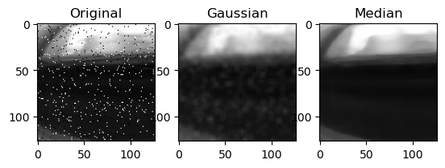

중앙값 필터(median filter)는 어떤 픽셀의 값을 주변 픽셀들의 중앙값으로 변환시켜주는 디지털 필터이다. 

[지난 글](https://partlyjadedyouth.github.io/cv-gaussian-smoothing/)에서 다루었던 Gaussian smoothing과 비슷하게 이미지를 흐릿하게 만드는 데 쓰인다. 하지만 쓰임새나 결과물의 느낌이 상당히 다르다.

## 1. Gaussian Filter vs Median Filter


*우측의 이미지는 원본 이미지를 $\sigma=3$의 Gaussian filter를 이용하여 smoothing한 결과이다. <br> Salt-and-pepper noise가 여전히 남아있는 것을 확인할 수 있다.*

Gaussian blur는 인접한 픽셀들의 **평균**을 이용한다. 이 경우 결과물이 `점잡음(salt-and-pepper noise)`과 같은 outlier들에 상당히 취약하다는 단점이 있다.


*Reference: https://neubias.github.io/training-resources/median_filter/index.html*

Median filter는 Gaussian smoothing과 다르게 convolution을 이용하여 계산하지 않는다. 

대신 인접한 픽셀들의 값을 전부 **정렬**(**sort**)한 다음 그 **중앙값**(**median**)을 구하므로, Gaussian smoothing에 비해 outlier들의 영향을 덜 받게 된다.

예를 들어 키가 170cm인 사람 4명과 200cm인 사람 1명이 있다고 해 보자. 5명의 키의 평균은 178cm이고 중앙값은 170cm인데, 평균의 경우 200cm라는 outlier때문에 중앙값에 비해 대표성이 떨어진다. Gaussian filter와 median filter의 차이점도 정확히 같은 이유에서 나온다고 볼 수 있다.

따라서 impulsive noise를 제거할 때에는 Gaussian smoothing보다는 median filtering을 사용하는 것이 바람직하다.

## 2. Drawbacks

### Cartoonization


*&nbsp;*

만약 편차가 적은 영역에 median filter를 적용하게 된다면, 해당 영역에 있는 대부분의 픽셀이 비슷한 값으로 치환될 것이다. 

이렇게 될 경우 이미지의 디테일이 사라지고 색이 비슷한 몇몇 영역만 덩어리처럼 남게 되는데, 이러한 현상을 마치 만화 그림체처럼 이미지가 변한다 하여 `cartoonization`이라고 한다.

### Algorithmic Implementation Issue

Median filter를 사용할 때 대부분의 계산 시간은 픽셀들을 정렬하는 데 들어간다. 따라서 어떤 정렬 알고리즘을 채택하는지에 따라서 filtering의 효율성이 좌우된다고 볼 수 있다.

문제는 $N$개의 픽셀을 정렬한다고 했을 때, 가장 빠른 정렬 알고리즘을 사용한다고 해도 그 시간복잡도(time complexity)가 $O(N \cdot logN)$이라는 것이다. Gaussian smoothing은 $O(2 \sqrt{N})$ 만에 convolution을 계산할 수 있다는 점을 고려해보면 상당히 비효율적이다.

## 3. Python Implementation

OpenCV의 `medianBlur`를 이용하면 median filtering을 쉽게 구현할 수 있다.

```python
cv2.medianBlur(src, ksize) -> dst
```
> `src` 원본 이미지
> 
> `ksize` Median kernel size (ksize x ksize)

### Example Code

Salt-and-pepper noise가 더해진 이미지에 각각 같은 크기의 Gaussian filter와 median filter를 적용하는 프로그램을 작성하였다.

```python
import cv2
import matplotlib.pyplot as plt

img = cv2.cvtColor(cv2.imread("saltpepper.png"), cv2.COLOR_BGR2RGB)
gaussian = cv2.GaussianBlur(img, (7, 7), 3)
median = cv2.medianBlur(img, 7)

plt.subplot(1, 3, 1)
plt.imshow(img)
plt.title("Original")

plt.subplot(1, 3, 2)
plt.imshow(gaussian)
plt.title("Gaussian")

plt.subplot(1, 3, 3)
plt.imshow(median)
plt.title("Median")

plt.show()
```

### Result


```toc

```